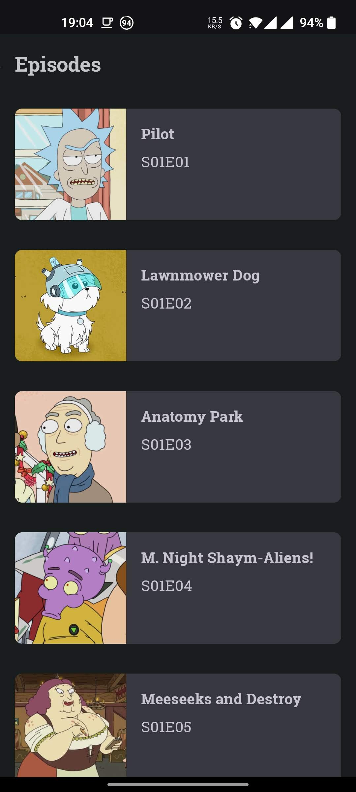
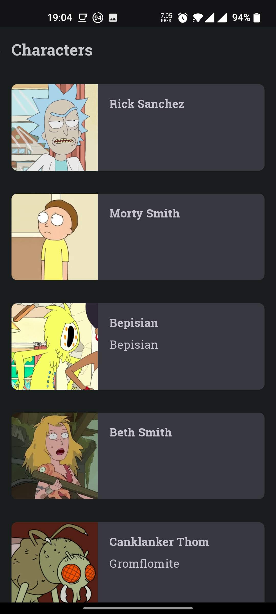
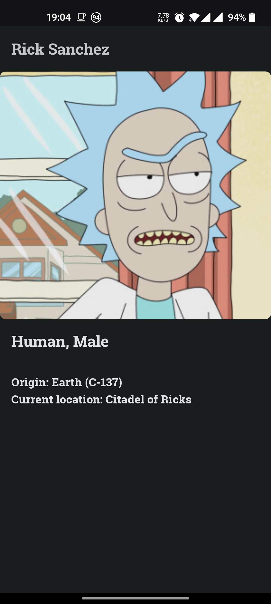

# Rick-and-Morty
This app uses the [Rick and Morty API](https://rickandmortyapi.com/) to display Episodes and Characters from Rick and Morty and has been created to showcase Jetpack Compose with Navigation component.

**App features:**
- List of Rick and Morty characters and episodes
- Character details
- Dynamic Light/ Dark theme.

## Screenshots

&nbsp;&nbsp;

&nbsp;&nbsp;

